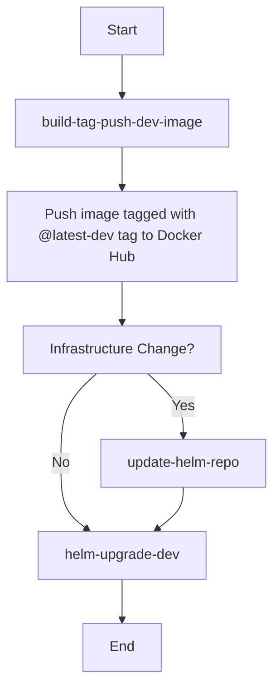

# CI Workflows Documentation

Our continuous integration process consists of three main GitHub workflows:

1. **build-tag-push-dev-image**: Responsible for building the application, creating its image, and pushing it to Docker Hub.
2. **update-helm-repo**: To be invoked only if the infrastructure undergoes any changes.
3. **helm-upgrade-dev**: Pulls the latest version of the `@latest-dev` tag of the image and performs a Helm upgrade on our development Kubernetes cluster.

## Workflow Details

### 1. `build-tag-push-dev-image`
This workflow is the first in the sequence and is essential for every deployment process. Here's what it does:

- Builds the next version of our application.
- Creates a Docker image of this build.
- Pushes the Docker image to Docker Hub with the tag `@latest-dev`.

### 2. `update-helm-repo`
This workflow should only be invoked if there's a change in our infrastructure. If there are no modifications, this step can be skipped because the development environment always defaults to the `@latest-dev` tag. The key responsibilities include:

- Updating the Helm repository with any new changes.

### 3. `helm-upgrade-dev`
This workflow carries out the following:

- Calls the `helm upgrade` command on the development Kubernetes cluster.
- Ensures that the cluster pulls down the latest version of the image tagged `@latest-dev`.

## Workflow Sequence



# Running GitHub Actions Locally with `act`

`act` allows you to run your GitHub Actions workflows locally. This is beneficial for testing your workflows before pushing to your repository. This guide will walk you through the process of setting up and using `act` locally.

## Prerequisites

- **Docker Desktop**: Ensure you have Docker Desktop installed and running. It's a dependency for `act`.
  - [Download Docker Desktop](https://www.docker.com/products/docker-desktop)

- **Homebrew**: You'll need the Homebrew package manager to install some tools.
  - [Install Homebrew](https://brew.sh/)

## Installation Steps

1. **Install `act` with Homebrew**:
```bash
brew install act
```

2. **Install `vlt` (Vault)**:
```bash
brew tap hashicorp/tap
brew install vlt
```

## Configuration

1. **Log in to `vlt`**:
```bash
vlt login
```

2. **Generate a `.env` file with `vlt`**:
At the root of your repository, there's a bash file `make-env.sh` that will utilize `vlt` to create a `.env` file. Run it:
```bash
./make-env.sh
```
This `.env` file contains secrets that `act` will use to simulate GitHub's secret storage mechanism.

## Running Workflows with `act`

1. **List available workflows**:
You can see a list of all the workflows in your repository with:
```bash
act -l
```

2. **Run a specific workflow**:
To run a particular workflow, use the `-j` flag followed by the workflow name. Ensure you reference the `.env` file for secrets:
```bash
act --secret-file .env -j helm-upgrade-dev
```

By following the above steps, you can simulate GitHub Actions workflows on your local machine, ensuring they run correctly before committing them to your repository.
