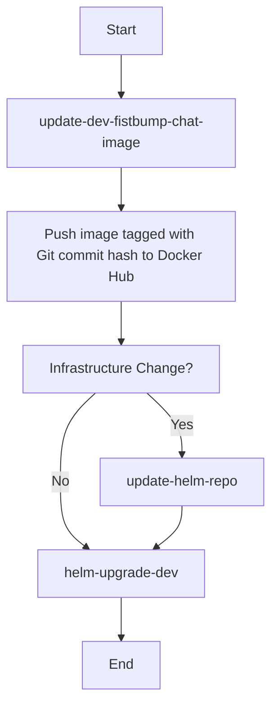

Certainly! Here's the updated documentation based on the changes:

# CI Workflows Documentation

Our continuous integration process consists of three main GitHub workflows:

1. **update-dev-fistbump-chat-image**: Responsible for building the application, creating its image, and pushing it to Docker Hub.
2. **update-helm-repo**: Updates the helm package and creates a pre-release version when appropriate.
3. **helm-upgrade-dev**: Pulls the latest Docker image using the latest prerelease version as a tag and performs a Helm upgrade on our development Kubernetes cluster.

## Workflow Details

### 1. `update-dev-fistbump-chat-image`
This workflow is the first in the sequence and is essential for every deployment process. Here's what it does:

- Builds the next version of our application.
- Creates a Docker image of this build.
- Pushes the Docker image to Docker Hub with the tag corresponding to the Git commit hash. This ensures that each image version can be traced back to a specific commit, enhancing traceability and debugging.

### 2. `update-helm-repo`
This workflow has been enhanced to dynamically manage the versioning of the Helm chart. If there's a current pre-release alpha version in the chart (like `0.0.1-alpha.1`), it will increment the alpha number (to `0.0.1-alpha.2`). If the version is a standard release (like `0.0.1`), it will increment the patch version and append the alpha tag (resulting in `0.0.2-alpha.1`). This strategy ensures that our Helm chart versions are always in sync with the application's lifecycle.

The key responsibilities of this workflow include:

- Updating the Helm repository with any new changes.
- Incrementing the Helm chart version based on the logic mentioned above.

### 3. `helm-upgrade-dev`
This workflow carries out the following:

- Calls the `helm upgrade` command on the development Kubernetes cluster.
- Ensures that the cluster pulls down the latest pre-release version.

## Workflow Sequence



This updated documentation provides a clear view of the changes introduced, making it easier for your team to understand and follow the updated CI workflows.

# Running GitHub Actions Locally

Running your GitHub Actions workflows locally ensures that they perform correctly before pushing them to your repository. This guide covers the process, from setup to execution.

## Prerequisites

- **Docker Dev Container**: Before getting started, make sure you're operating within the Docker Dev Container.
  - [Launch Docker Dev Environment](https://open.docker.com/dashboard/dev-envs?url=https://github.com/titan-syndicate/glowing-system)

- **npm**: If you're in a new dev container, remember to execute `npm install`.

- **HashiCorp Vault**: Being configured with HashiCorp Vault Secrets is essential. Running GitHub Actions locally will require several secrets.

## Configuration

1. **Sync Secrets**:
Run the following npm script to generate a `.env.secrets` file:
```bash
npm run sync-secrets
```
Ensure this file is populated with genuine values, not error messages from Vault.

## Running Workflows

1. **Access NPM Scripts**:
Access an interactive list of npm scripts using:
```bash
npm run interactive
```
or the shorter:
```bash
npm run i
```

2. **Select a Workflow**:
When searching for a GitHub Action workflow to run, they all start with `wf-`. Use the interactive menu, and input `wf-` to narrow down your choices.

## Tips and Tricks

- All GitHub Action workflows are prefixed with `wf-`, making it easy to locate them in the interactive menu.

- Always verify the `.env.secrets` file for its content after running the `sync-secrets` npm script. This step ensures there's no error message from Vault Secrets, and the secrets are fetched correctly.

By adhering to these steps, you can simulate GitHub Actions workflows locally, ensuring they're free of issues before pushing them to your repository.
