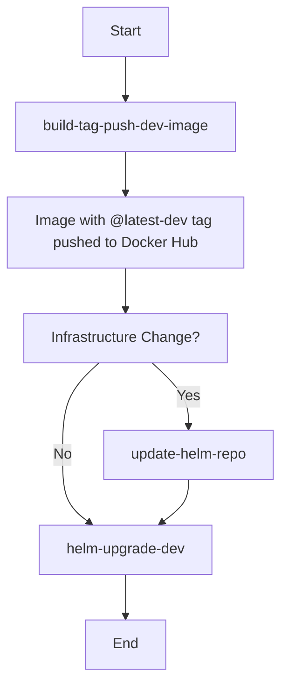

# CI Workflows Documentation

Our continuous integration process consists of three main GitHub workflows:

1. **build-tag-push-dev-image**: Responsible for building the application, creating its image, and pushing it to Docker Hub.
2. **update-helm-repo**: To be invoked only if the infrastructure undergoes any changes.
3. **helm-upgrade-dev**: Pulls the latest version of the `@latest-dev` tag of the image and performs a Helm upgrade on our development Kubernetes cluster.

## Workflow Details

### 1. `build-tag-push-dev-image`
This workflow is the first in the sequence and is essential for every deployment process. Here's what it does:

- Builds the next version of our application.
- Creates a Docker image of this build.
- Pushes the Docker image to Docker Hub with the tag `@latest-dev`.

### 2. `update-helm-repo`
This workflow should only be invoked if there's a change in our infrastructure. If there are no modifications, this step can be skipped because the development environment always defaults to the `@latest-dev` tag. The key responsibilities include:

- Updating the Helm repository with any new changes.

### 3. `helm-upgrade-dev`
This workflow carries out the following:

- Calls the `helm upgrade` command on the development Kubernetes cluster.
- Ensures that the cluster pulls down the latest version of the image tagged `@latest-dev`.

## Workflow Sequence

